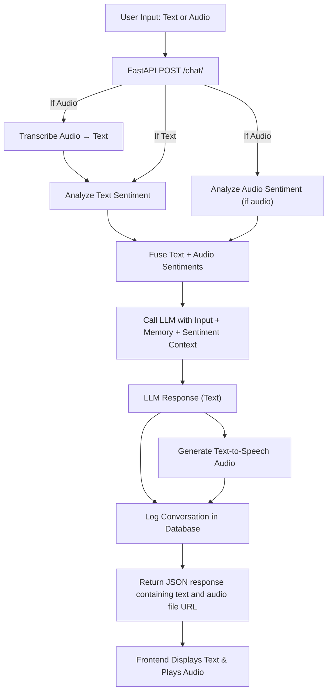

# 🤖 CyFutureAI — L1 Automation Chatbot & Voicebot for Customer Care

<p align="center">
  
  
  
  
</p>

🚀 **CyFutureAI** is a fully functional, end-to-end intelligent chatbot & voicebot system designed to automate Level-1 customer support. It combines the power of **LangChain**, **LLMs (Azure OpenAI GPT-4o)**, **sentiment fusion**, **voice interaction**, and **contextual memory** to deliver accurate and human-like query resolution.

---

## 📸 Demo (Coming Soon)

> Screen recording of real-time interaction, including voice input/output, memory-aware follow-up, and context handling.

---

## 🌐 Features

* ✅ **Text & Audio Support**: Accepts both text and voice input.
* 🧠 **LLM-Powered Conversations**: Uses Azure OpenAI’s GPT-4o via LangChain v3.0.
* 💬 **Memory-Aware Chat**: Summarized long-term memory with `ConversationSummaryBufferMemory`.
* 👢 **Sentiment Fusion**: Combines text + voice tone for smarter emotion-aware responses.
* 🎤 **Speech-to-Text**: Uses Whisper for audio transcription.
* 🔊 **Text-to-Speech**: Uses pyttsx3 for audio replies.
* 🌍 **Interactive Frontend**: Built with HTML, CSS, JS for real-time voice/text chat.
* 📆 **Local DB Logging**: Saves user queries, bot replies, and sentiments via SQLite.
* 🧠 **Pluggable Knowledge Base**: (Planned) Load external documents and FAQs for enhanced answering.
* 📡 **FastAPI Backend**: Handles full request lifecycle with audio/text, threading, and structured endpoints.

---

## 🏗️ Project Architecture


---

## 🧹 Tech Stack

| Layer       | Technology                               |
| ----------- | ---------------------------------------- |
| 🎯 Backend  | Python, FastAPI                          |
| 🧠 AI       | LangChain 3.0, Azure OpenAI GPT-4o       |
| 💻 Memory   | LangChain Summary Buffer                 |
| 🧪 NLP      | VaderSentiment, Whisper, pyAudioAnalysis |
| 🔊 Audio    | pyttsx3, Whisper                         |
| 📁 Database | SQLite                                   |
| 🖥 Frontend | HTML, CSS, Vanilla JS                    |
| 📦 Others   | Python threading, uuid, Jinja2           |

---

## 📁 Directory Structure

```
project-cyfutureai/
│
├── main.py                       # FastAPI backend logic
├── audio_transcriber.py          # Whisper transcriber
├── audio_sentiment.py            # Emotion detection via audio
├── text_sentiment.py             # Vader-based sentiment
├── fusion_logic.py               # Rule-based sentiment fusion
├── llm_chain.py                  # LangChain + Azure GPT-4o interface
├── chat_memory.py                # LLM memory using summary buffer
├── tts_response.py               # Text-to-speech audio output
├── database.py                   # Chat logging into SQLite
│
├── templates/
│   └── index.html                # Interactive frontend
├── static/
│   ├── favicon.ico               # For tab icon
│   ├── styles.css                # Frontend styling
│   └── audio/                    # TTS response files
│
├── uploads/                      # Incoming audio files
│
├── chatbot.log                   # All logs
├── conversations.db              # SQLite DB file
├── requirements.txt              # All dependencies
└── README.md                     # This file
```

---

## ⚙️ Getting Started

### 1. Clone the Repository

```bash
git clone https://github.com/yourusername/project-cyfutureai.git
cd project-cyfutureai
```

### 2. Create Virtual Environment

```bash
python -m venv .venv
source .venv/bin/activate  # On Windows: .venv\Scripts\activate
```

### 3. Install Dependencies

```bash
pip install -r requirements.txt
```

### 4. Set Environment Variables

Set these before running (replace with your actual values):

```bash
export AZURE_OPENAI_API_KEY=your_key
export AZURE_OPENAI_ENDPOINT=your_endpoint
```

On Windows:

```cmd
set AZURE_OPENAI_API_KEY=your_key
set AZURE_OPENAI_ENDPOINT=your_endpoint
```

### 5. Start the App

```bash
uvicorn main:app --reload
```

---

## 🚧 To-Do & Upcoming Features

* [ ] 🔍 **External Knowledge Integration** (via FAISS + LangChain retriever)
* [ ] 🎧 Audio Record Cancel/Re-record Feature (frontend UX)
* [ ] 🌐 Multilingual Translation Support
* [ ] 🧾 Advanced Logging with Query Categories
* [ ] ☁️ Docker Deployment Guide
* [ ] 📁 API Documentation with Swagger

---

## 🤝 Contributing

We welcome pull requests, suggestions, and feedback! To contribute:

* Fork the repo
* Create your feature branch (`git checkout -b feature/your-feature`)
* Commit your changes
* Push to your branch
* Open a Pull Request

---

## 📄 License

This project is under the [MIT License](LICENSE).

---

## 💡 Inspiration

Built with the vision of reducing customer support overhead by creating a smart, empathetic, and scalable L1 support bot that understands voice, tone, and intent — not just words.

---

## 📬 Contact

For collaboration or queries:

* 📬 Email: [rupam.ganguly46@gmail.com](mailto:rupam.ganguly46@gmail.com)
* 🧠 LinkedIn: [www.linkedin.com/in/rupam-ganguly-88329328b](www.linkedin.com/in/rupam-ganguly-88329328b)

---

> ⭐ Don’t forget to Star the repo if you find it helpful!
